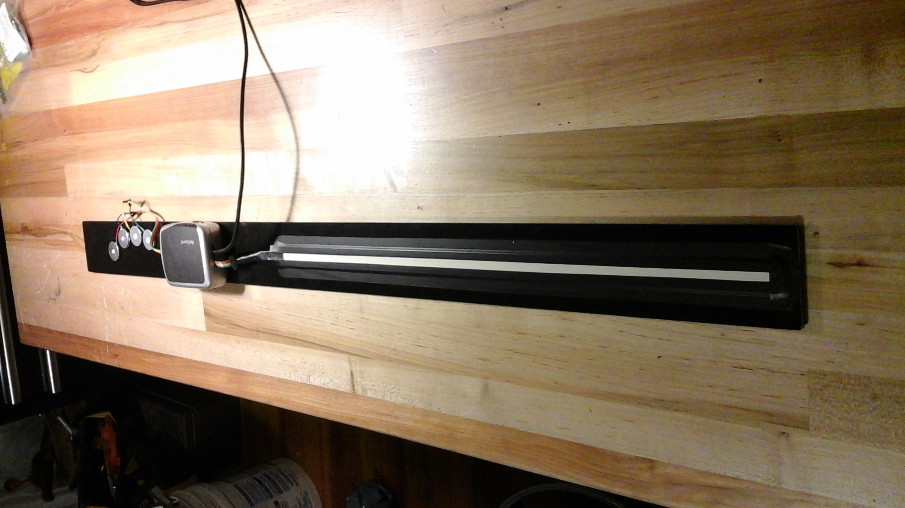
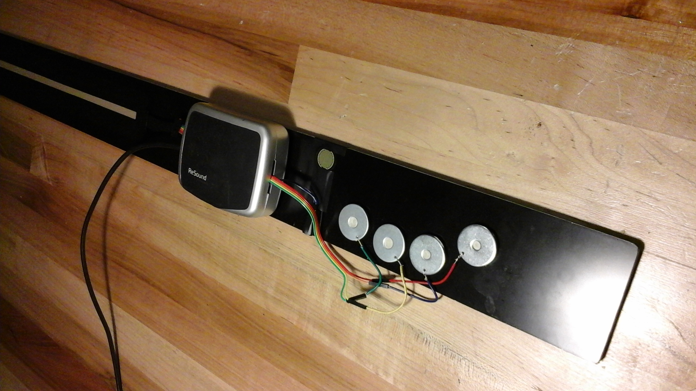
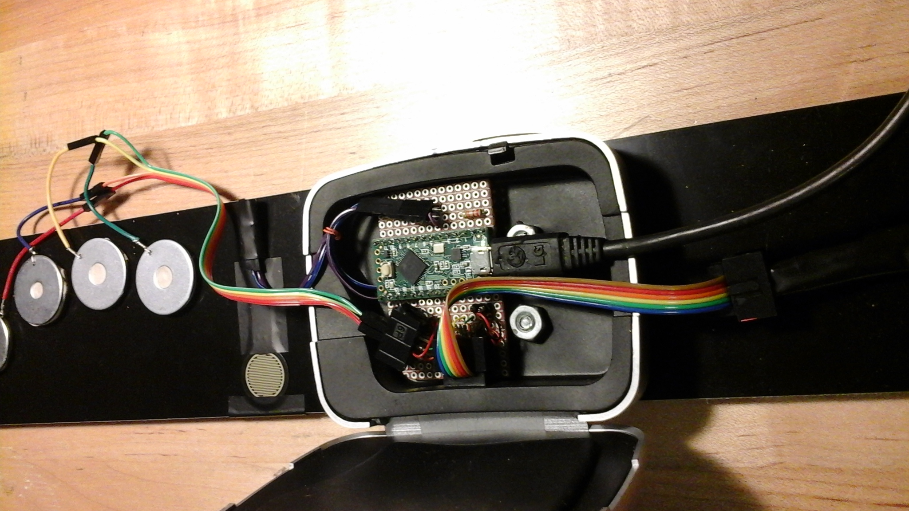

# tonestrip

This is a MIDI input device inspired by 
[Gordon Reid's description](http://www.soundonsound.com/sos/Jul03/articles/synthsecrets51.asp) 
of the [Ondes Martenot](https://en.wikipedia.org/wiki/Ondes_Martenot).
I thought I would see if I could build something similar out of modern components.
The processor is a [Teensy LC](http://www.pjrc.com/teensy/teensyLC.html) running 
as a USB MIDI device, and you can [see the code here](tonestrip.ino).

The strip on the right is a 500mm membrane softpot sandwiched on top of a long-format 
force-sensitive resistor (FSR). Pressing the strip sends pitch bend messages according 
to the position of your finger, and modulation controller messages according to the 
pressure. When the softpot is not being pressed, its voltage floats at some indeterminate 
point, so I've made it so that releasing pressure on the strip leaves the pitch bend where 
it was.

To be any fun to play, the pitch bend really needs to go into a synth with a 
configurable bend range, because otherwise you're moving a very long way just to get 
a couple semitones of variation. I find two octaves in each direction (the strip only 
bends sharp, not flat) to be a nice balance. The Teensy has 12-bit analog inputs, and
the softpot is made for industrial control, so the precision is pretty incredible. It's 
only 1 bit shy of the maximum resolution you can send for a pitch bend in one direction.
It's sensitive enough that wiggling a finger on it creates smooth and convincing 
vibrato similar to what you get on a fretless stringed instrument.

On the left there's a small circular FSR which can be pressed on to send velocity and 
polyphonic aftertouch events. Left of these there are four washers which act as touch inputs.
I've configured them something like the valves of a horn, where touching each drops 
the fundamental tone of the instrument by a certain number of semitones.

I'm still getting the hang of it, but this instrument feels incredibly responsive, with
under a millisecond of latency on all controls. The character is reminiscent of a wind 
instrument, anything from a recorder to a trombone, and it can also make some spacey 
wails and warbles if I just noodle randomly on the strip. I haven't made schematics, because 
it's not much more than the sensors and some reference resistors, but if you want to build 
something similar and need more than just this description, please let me know.

# Pics (or it didn't happen)

Overview of the device:

The left hand controls:

The guts that make it work:

